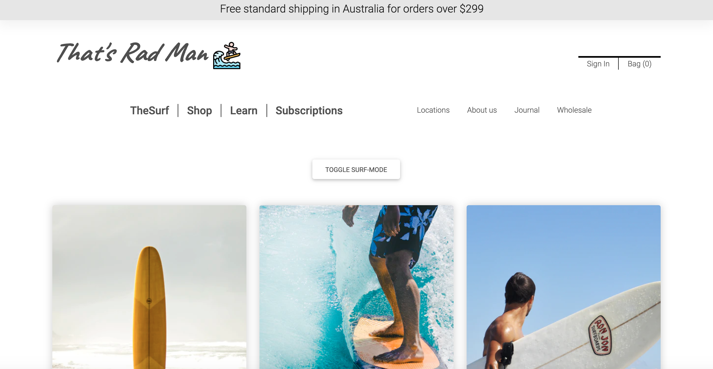
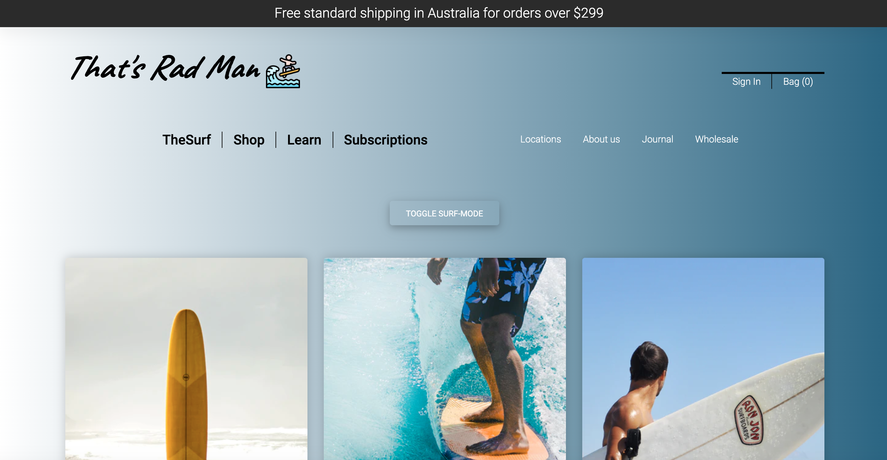

# README

# That's Rad Man

## About

That's Rad Man was created as a front end exercise to sharpen my front end skills.



This application was built with
```
Ruby on Rails, Javascript, HTML & CSS.
```

## Live site:

[That's Rad Man](https://rad-man.herokuapp.com/)

## Setup

If you would like to look at the code then clone the GitHub repository and change directory into `new-surfing`:
```
gh repo clone Tom-Tee/That-s-Rad-Man
```

Ensure that you have Rails and Ruby installed on your computer

You will also need Bundler installed:
```
bundle install
```
This will install the gems needed to run the program correctly.

## Navigating the application

This is a simple landing page to sharpen my skills with HTML CSS & Javascript. 

There is an optional *surf mode* that will show upon selection.



The responsiveness of this application was done with Bootstrap 5 as well as an edited footer:

[UI - Home](docs/footer.png)

